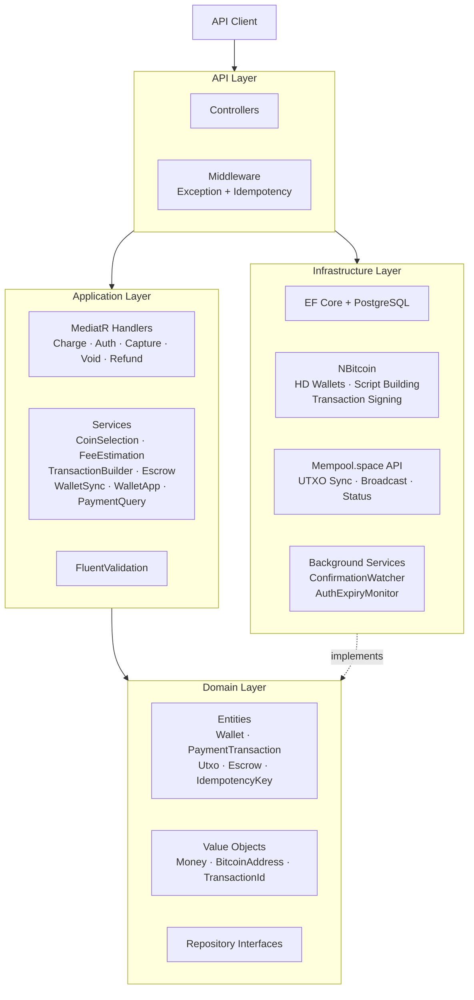
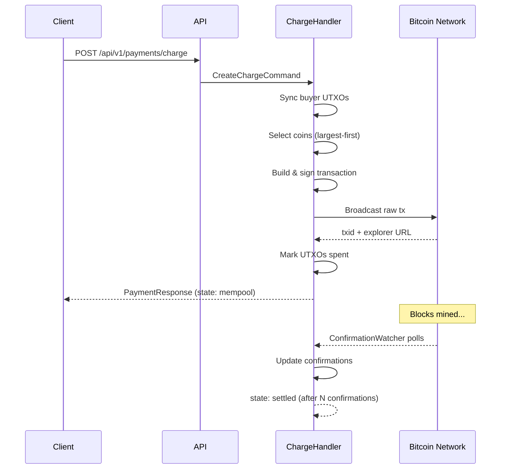
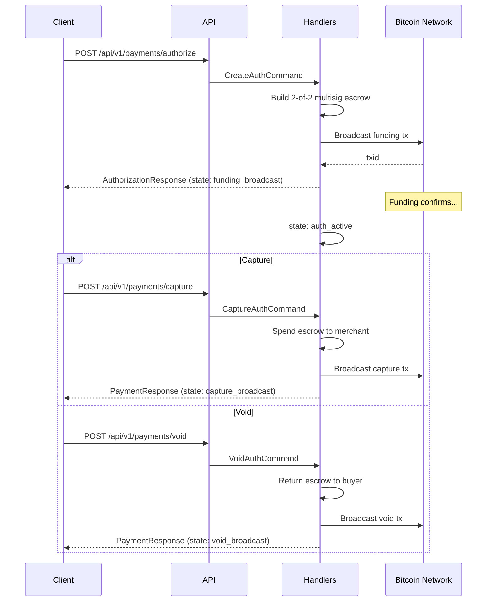
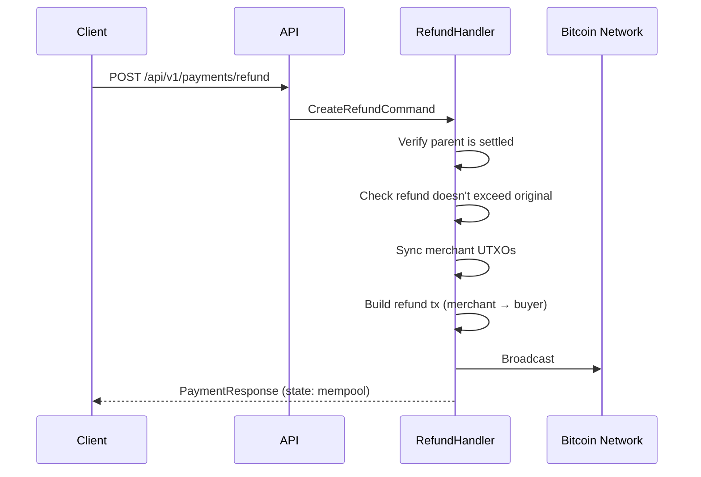
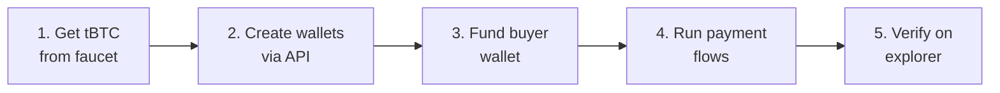
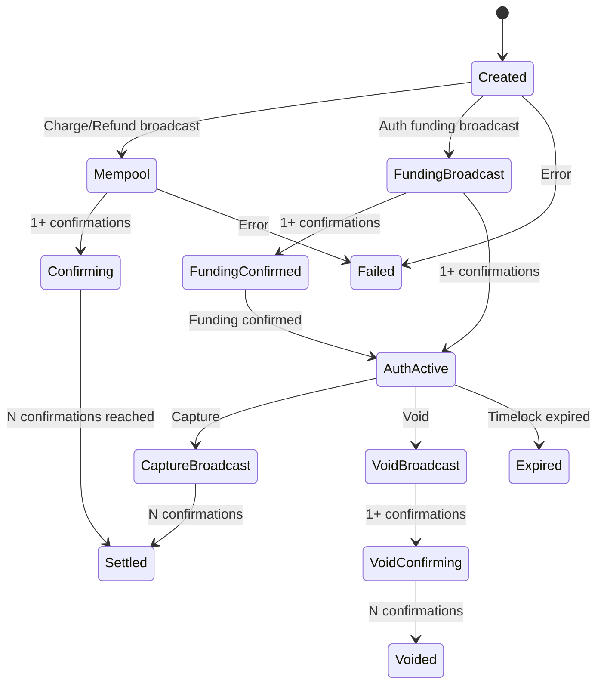

# Digital Wallet - Bitcoin Payment Platform

Bitcoin payment processing API built with .NET 10 and Clean Architecture. Supports charge, authorize/capture/void, and refund flows against Bitcoin testnet4.

> **POC Status**: This is a proof-of-concept demonstrating Bitcoin payment integration for the FlexPay platform.

## Architecture



## Payment Flows

### Charge Flow (Direct Payment)



### Authorize / Capture Flow



### Refund Flow



## Quick Start

### Prerequisites

- [.NET 10 SDK](https://dotnet.microsoft.com/download/dotnet/10.0)
- [Docker](https://docs.docker.com/get-docker/) (for PostgreSQL and bitcoind)

### Run Locally

```bash
# 1. Clone
git clone https://github.com/dimon2255/digital-wallet.git
cd digital-wallet

# 2. Start infrastructure (PostgreSQL + bitcoind regtest)
docker-compose up -d

# 3. Restore tools and run
dotnet tool restore
dotnet run --project src/BitcoinPayments.API
```

The API starts at:
- **HTTPS**: https://localhost:5001
- **HTTP**: http://localhost:5000
- **OpenAPI docs**: http://localhost:5000/scalar/v1
- **Health check**: http://localhost:5000/health

### Run Tests

```bash
# All tests
dotnet test BitcoinPayments.sln

# Unit tests only (fast, no Docker needed)
dotnet test tests/BitcoinPayments.UnitTests

# Integration tests (requires Docker for Testcontainers)
dotnet test tests/BitcoinPayments.IntegrationTests

# E2E tests
dotnet test tests/BitcoinPayments.EndToEndTests
```

## API Endpoints

### Wallets

| Method | Endpoint | Description |
|--------|----------|-------------|
| `POST` | `/api/v1/wallets` | Create a new HD wallet |
| `GET` | `/api/v1/wallets/{id}` | Get wallet details |
| `GET` | `/api/v1/wallets/{id}/address` | Generate next receiving address |
| `GET` | `/api/v1/wallets/{id}/utxos` | List wallet UTXOs |

### Payments

All payment endpoints require an `Idempotency-Key` header.

| Method | Endpoint | Description |
|--------|----------|-------------|
| `POST` | `/api/v1/payments/charge` | Direct payment (buyer → merchant) |
| `POST` | `/api/v1/payments/authorize` | Create authorization hold (escrow) |
| `POST` | `/api/v1/payments/capture` | Settle an authorization |
| `POST` | `/api/v1/payments/void` | Cancel an authorization |
| `POST` | `/api/v1/payments/refund` | Refund a settled payment |
| `GET` | `/api/v1/payments/{id}` | Get payment status |
| `GET` | `/api/v1/payments/{id}/history` | Get payment history |

### Example: Create a Charge

```bash
curl -X POST http://localhost:5000/api/v1/payments/charge \
  -H "Content-Type: application/json" \
  -H "Idempotency-Key: unique-key-123" \
  -d '{
    "buyerWalletId": "BUYER_WALLET_GUID",
    "merchantWalletId": "MERCHANT_WALLET_GUID",
    "amountSatoshis": 50000
  }'
```

## Testing with Testnet4

### What is Testnet4?

Testnet4 is Bitcoin's public test network. It uses worthless test coins (tBTC) that you get for free from faucets. Transactions behave exactly like mainnet — they go on a real blockchain, get mined, and confirm — but with zero financial risk.

### Step-by-Step Testing Guide



**1. Get test Bitcoin from a faucet**

Visit a testnet4 faucet to receive free test coins:
- https://mempool.space/testnet4/faucet (when available)
- Search for "bitcoin testnet4 faucet" for current options

**2. Create wallets**

```bash
# Create buyer wallet
curl -X POST http://localhost:5000/api/v1/wallets \
  -H "Content-Type: application/json" \
  -d '{"name": "Buyer Wallet"}'

# Create merchant wallet
curl -X POST http://localhost:5000/api/v1/wallets \
  -H "Content-Type: application/json" \
  -d '{"name": "Merchant Wallet"}'
```

**3. Get a receiving address and fund it**

```bash
# Get buyer's receiving address
curl http://localhost:5000/api/v1/wallets/{buyerWalletId}/address
```

Send tBTC from the faucet to this address.

**4. Execute payment flows**

Once the funding transaction confirms, run charges, authorizations, captures, voids, and refunds through the API.

**5. Verify on explorer**

Each payment response includes an `explorerUrl` — click it to see the transaction on [mempool.space/testnet4](https://mempool.space/testnet4).

## 5-Minute Demo Walkthrough

For Product and CS teams — here's the fastest path to see Bitcoin payments in action:

1. **Start the stack**: `docker-compose up -d && dotnet run --project src/BitcoinPayments.API`
2. **Open Scalar UI**: Navigate to http://localhost:5000/scalar/v1
3. **Create two wallets**: POST to `/api/v1/wallets` twice (buyer + merchant)
4. **Get buyer address**: GET `/api/v1/wallets/{buyerWalletId}/address`
5. **Fund from faucet**: Send test Bitcoin to the buyer address
6. **Execute a charge**: POST `/api/v1/payments/charge` with both wallet IDs
7. **Watch it confirm**: GET `/api/v1/payments/{id}` — state goes from `mempool` → `confirming` → `settled`
8. **Run a refund**: POST `/api/v1/payments/refund` to reverse it

The entire flow demonstrates: wallet creation, address derivation, UTXO tracking, transaction building, broadcasting, and confirmation monitoring.

## Transaction State Machine



## Configuration

### Environment-specific settings

| Setting | Development (regtest) | Production (testnet4) |
|---------|----------------------|----------------------|
| Network | `regtest` | `testnet4` |
| Fee rate | 1 sat/vbyte | 2 sat/vbyte |
| Auth window | 6 blocks | 144 blocks |
| Settlement confirmations | 1 | 3 |

### Key configuration sections (`appsettings.json`)

- `Bitcoin` — network, fee rates, confirmation thresholds, mempool API URL
- `ConnectionStrings:DefaultConnection` — PostgreSQL connection
- `BackgroundServices` — polling intervals for watchers

## Tech Stack

| Component | Technology |
|-----------|-----------|
| Runtime | .NET 10 |
| Architecture | Clean Architecture (4 layers) |
| CQRS | MediatR 14.1 |
| Validation | FluentValidation 12.1 |
| ORM | EF Core 10 + PostgreSQL (Npgsql) |
| Bitcoin | NBitcoin 9.0.5 (HD wallets, script building, signing) |
| HTTP Resilience | Microsoft.Extensions.Http.Resilience |
| Logging | Serilog |
| API Docs | Microsoft.AspNetCore.OpenApi + Scalar |
| Testing | xunit 2.9 + Moq + Testcontainers |
| CI/CD | GitHub Actions |

## Safety

- **Mainnet is permanently blocked** — `NetworkGuard` throws `MainnetGuardException` at startup if the network resolves to mainnet
- All payment operations require idempotency keys
- HD wallet master keys are encrypted via ASP.NET DataProtection
- Authorization escrow uses on-chain 2-of-2 multisig with timelock (not custodial holding)
