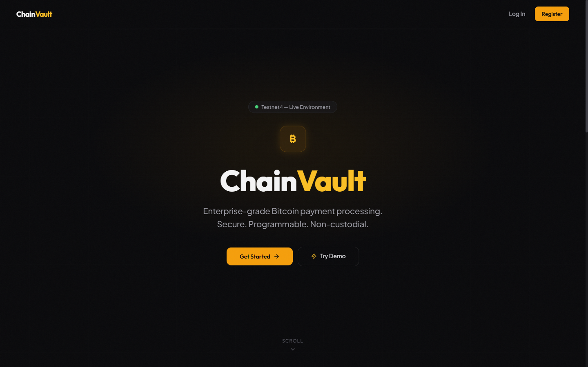
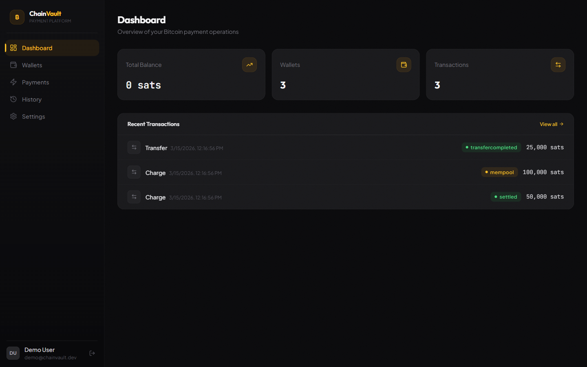
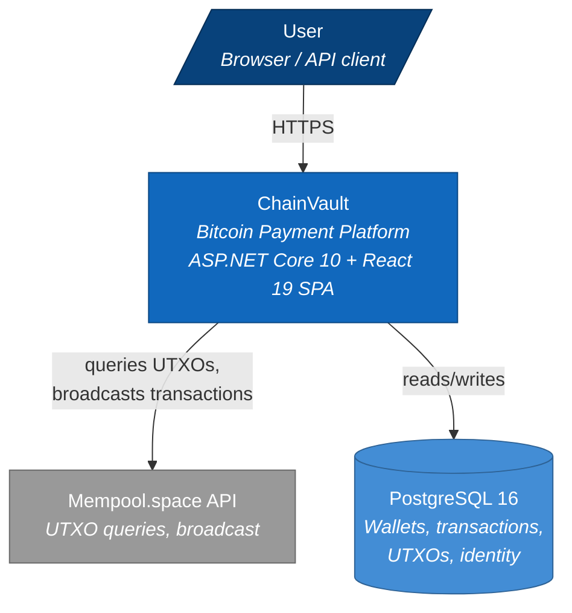
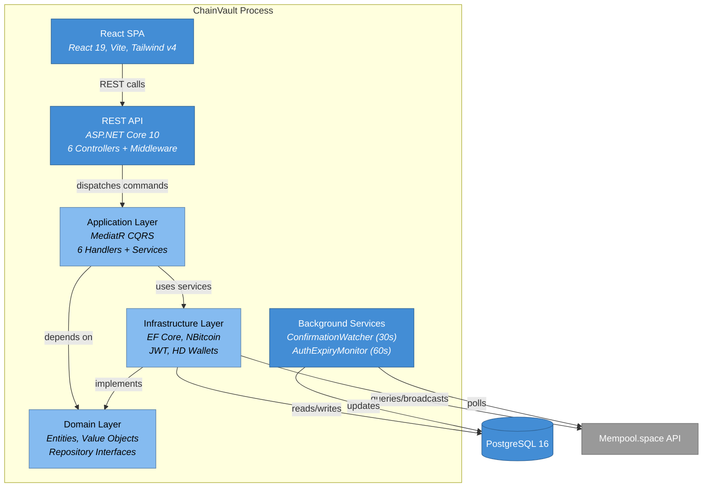

# ChainVault — Bitcoin Payment Platform

Bitcoin payment processing platform built with .NET 10 and Clean Architecture. Supports charge, authorize/capture/void, refund, and wallet-to-wallet transfer flows against Bitcoin testnet4.

> **POC Status**: Proof-of-concept demonstrating Bitcoin payment integration for the FlexPay platform.

<p align="center">
  
</p>

<p align="center">
  
</p>

## System Overview



## Architecture



## Quick Start

```bash
# Start infrastructure (PostgreSQL + bitcoind regtest)
docker-compose up -d

# Run API (auto-migrates DB + seeds demo user)
dotnet tool restore
dotnet run --project src/BitcoinPayments.API

# (Optional) Run SPA dev server with hot reload
cd src/BitcoinPayments.UI && npm install && npm run dev
```

| Endpoint | URL |
|----------|-----|
| API | https://localhost:5001 |
| SPA dev server | http://localhost:5173 |
| OpenAPI docs | http://localhost:5000/scalar/v1 |
| Health check | http://localhost:5000/health |

**Demo account:** demo@chainvault.dev / Demo123! (pre-seeded with 3 wallets + sample transactions)

## Tech Stack

| Component | Technology |
|-----------|-----------|
| Backend | .NET 10, ASP.NET Core, MediatR, FluentValidation, EF Core 10 |
| Bitcoin | NBitcoin 9.0.5 (HD wallets, script building, signing) |
| Frontend | React 19, Vite 8, Tailwind v4, Zustand, TanStack Query |
| Database | PostgreSQL 16 (Npgsql) |
| Auth | ASP.NET Core Identity + JWT Bearer (self-issued) |
| Testing | xUnit, Moq, Testcontainers, Mvc.Testing |
| CI/CD | GitHub Actions |

## Safety

- **Mainnet permanently blocked** — `NetworkGuard` throws at startup if network resolves to mainnet
- All payment operations require `Idempotency-Key` header
- HD wallet master keys encrypted via ASP.NET DataProtection
- Authorization escrow uses on-chain 2-of-2 multisig with timelock

## Documentation

Detailed architecture documentation lives in [`docs/`](docs/):

| Document | Contents |
|----------|----------|
| [System Context](docs/01-system-context.md) | C4 Layer 1 — actors, external systems, boundaries |
| [Containers](docs/02-containers.md) | C4 Layer 2 — deployable units, communication paths |
| [Domain Components](docs/03-components/domain.md) | Entities, value objects, enums, interfaces, exceptions |
| [Application Components](docs/03-components/application.md) | CQRS commands, handlers, services, transfer strategies |
| [Infrastructure Components](docs/03-components/infrastructure.md) | EF Core, Bitcoin services, JWT, background workers |
| [API Components](docs/03-components/api.md) | Controllers, middleware pipeline, contracts |
| [Frontend Components](docs/03-components/frontend.md) | React pages, hooks, API clients, routing |
| [Data Flow](docs/04-data-flow.md) | Payment flows, state machine, persistence model |
| [Development Guide](docs/05-development-guide.md) | Build, test, configure, API endpoints, testnet4 guide |
