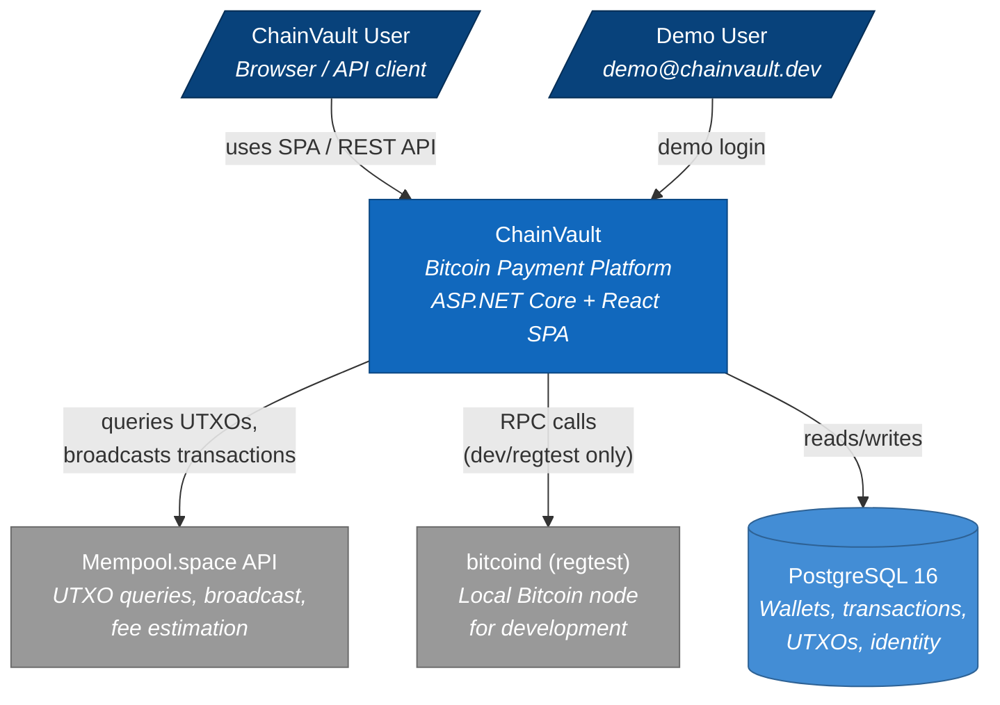

<!-- Generated by Atlas | Last updated: 2026-03-15 | Source commit: 3718dc7 -->
<!-- Edits below the ATLAS-END marker will be preserved on refresh -->

# Layer 1: System Context

ChainVault is a Bitcoin payment processing platform that enables charge, authorize/capture/void, refund, and wallet-to-wallet transfer operations against Bitcoin testnet4. It serves as a proof-of-concept for integrating Bitcoin payments into the FlexPay platform.

The system is a single deployable unit — an ASP.NET Core Web API that hosts a React SPA frontend and interacts with two external systems: a PostgreSQL database for persistence and the Bitcoin network (testnet4 via mempool.space API, or regtest via local bitcoind).

## System Context Diagram

## External Actors

| Actor | Description |
|-------|-------------|
| **ChainVault User** | Authenticates via JWT, manages wallets, initiates payments through the SPA or REST API |
| **Demo User** | Pre-seeded account (demo@chainvault.dev / Demo123!) with 3 wallets and sample transactions |

## External Systems

| System | Role | Protocol |
|--------|------|----------|
| **Mempool.space API** | UTXO lookup, transaction broadcast, block explorer links | HTTPS REST (with Polly retry) |
| **bitcoind (regtest)** | Local Bitcoin node for development — block generation, RPC wallet operations | JSON-RPC over HTTP |
| **PostgreSQL 16** | Relational store for wallets, transactions, UTXOs, escrows, identity, refresh tokens | TCP (Npgsql) |

## Key Boundaries

- **Network safety**: `NetworkGuard` hard-blocks mainnet at startup — the system only operates on testnet4 or regtest
- **Authentication boundary**: JWT Bearer tokens (self-issued, 15min access / 7-day refresh). No external auth provider
- **Idempotency boundary**: All payment endpoints require an `Idempotency-Key` header
- **User scoping**: Wallets are scoped to authenticated users via `Wallet.UserId`

<!-- ATLAS-END — edits below this line will be preserved on refresh -->
