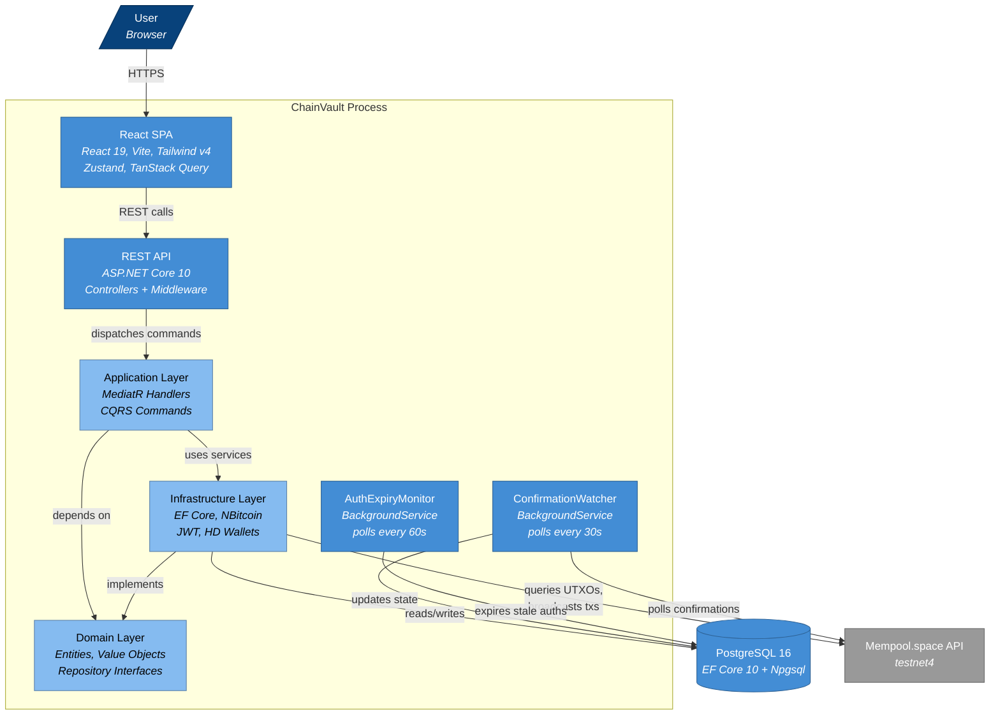

<!-- Generated by Atlas | Last updated: 2026-03-15 | Source commit: 3718dc7 -->
<!-- Edits below the ATLAS-END marker will be preserved on refresh -->

# Layer 2: Containers

ChainVault is a single-process deployment consisting of an ASP.NET Core host that serves both a REST API and a React SPA. It connects to PostgreSQL for persistence and the Bitcoin network for on-chain operations. Two in-process background services handle asynchronous confirmation tracking and authorization expiry.

## Container Diagram

## Container Inventory

| Container | Technology | Responsibility |
|-----------|-----------|----------------|
| **React SPA** | React 19, Vite 8, Tailwind v4, Zustand, TanStack Query | User interface — dashboard, wallets, payments, transactions |
| **REST API** | ASP.NET Core 10, 6 controllers, JWT Bearer auth | HTTP entry point — routing, auth, idempotency, exception handling |
| **Application Layer** | MediatR 12.1, FluentValidation 12.1 | CQRS command handling — charge, auth, capture, void, refund, transfer |
| **Infrastructure Layer** | EF Core 10, NBitcoin 9.0.5, Polly | Persistence, Bitcoin operations, HD wallet management, JWT tokens |
| **Domain Layer** | Pure C# (+ NBitcoin for value objects) | Entities, value objects, enums, repository interfaces |
| **ConfirmationWatcher** | BackgroundService (30s interval) | Polls mempool.space for confirmation counts, advances transaction states |
| **AuthExpiryMonitor** | BackgroundService (60s interval) | Expires stale authorizations that exceeded their timelock window |
| **PostgreSQL 16** | Npgsql provider, EF Core migrations | Wallets, transactions, UTXOs, escrows, identity, refresh tokens |
| **Mempool.space API** | HTTP + Polly retry | UTXO queries, transaction broadcast, confirmation status |

## Communication Paths

| From | To | Protocol | Description |
|------|----|----------|-------------|
| Browser | SPA | HTTPS | Serves React app via ASP.NET static files |
| SPA | API | REST/JSON | Proxied in dev (Vite → localhost:5041), direct in prod |
| API | Application | In-process | MediatR `Send()` dispatches commands to handlers |
| Application | Infrastructure | In-process | Service calls (coin selection, fee estimation, wallet sync) |
| Infrastructure | PostgreSQL | TCP | EF Core queries and commands via Npgsql |
| Infrastructure | Mempool.space | HTTPS | UTXO sync, broadcast, fee estimation |
| ConfirmationWatcher | Mempool.space | HTTPS | Polls transaction confirmation counts |
| ConfirmationWatcher | PostgreSQL | TCP | Updates transaction state on confirmation thresholds |
| AuthExpiryMonitor | PostgreSQL | TCP | Marks expired authorizations |

## Deployment Model

**Development**: Single process via `dotnet run`, SPA dev server via `npm run dev` (Vite proxy). Docker Compose provides PostgreSQL 16 and bitcoind regtest.

**Production build**: `npm run build` outputs SPA to `wwwroot/`, served by ASP.NET Core via `MapFallbackToFile`. Single deployable container.

<!-- ATLAS-END — edits below this line will be preserved on refresh -->
