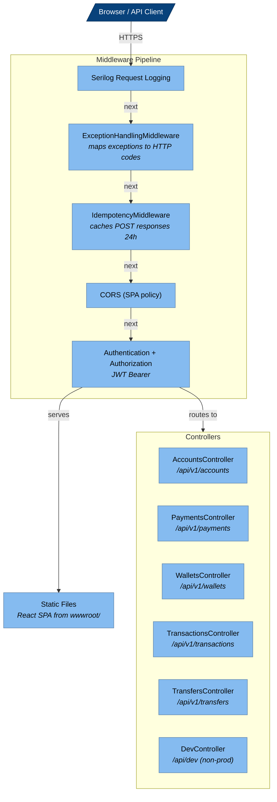

<!-- Generated by Atlas | Last updated: 2026-03-15 | Source commit: 3718dc7 -->
<!-- Edits below the ATLAS-END marker will be preserved on refresh -->

# Layer 3: API Components

The API layer is the outermost ring — an ASP.NET Core 10 Web API that hosts REST endpoints, middleware pipeline, JWT authentication, and serves the React SPA as static files. It delegates all business logic to the Application layer via MediatR commands and application services.

**Project:** `BitcoinPayments.API` | **Framework:** net10.0 (Web SDK) | **Dependencies:** Scalar 2.11.3, Serilog, FluentValidation DI

## Component Diagram

## Middleware Pipeline (order matters)

| # | Middleware | Behavior |
|---|-----------|----------|
| 1 | `UseSerilogRequestLogging()` | Structured request/response logging |
| 2 | `ExceptionHandlingMiddleware` | Catches domain exceptions → HTTP status codes (see mapping below) |
| 3 | `IdempotencyMiddleware` | Enforces `Idempotency-Key` header on POST/PUT/PATCH/DELETE. Skips `/api/v1/accounts/*`. Caches responses 24h |
| 4 | `UseCors("SPA")` | Allows localhost:5173 (Vite dev server). Exposes `Idempotency-Key` header |
| 5 | `UseAuthentication()` + `UseAuthorization()` | JWT Bearer validation (HS256) |
| 6 | `UseDefaultFiles()` + `UseStaticFiles()` | Serves React SPA from wwwroot/ |
| 7 | `MapControllers()` | Attribute-routed API endpoints |
| 8 | `MapHealthChecks("/health")` | Health probe |
| 9 | `MapFallbackToFile("index.html")` | SPA client-side routing fallback |

### Exception → HTTP Mapping

| Exception | Status | Error Code |
|-----------|--------|------------|
| `UnauthorizedAccessException` | 401 | UNAUTHORIZED |
| `ForbiddenAccessException` | 403 | FORBIDDEN |
| `InsufficientFundsException` | 400 | INSUFFICIENT_FUNDS |
| `EscrowNotFoundException` | 404 | ESCROW_NOT_FOUND |
| `InvalidOperationStateException` | 409 | INVALID_OPERATION_STATE |
| `AuthorizationExpiredException` | 409 | AUTHORIZATION_EXPIRED |
| `TransactionBroadcastException` | 502 | TRANSACTION_BROADCAST_FAILED |
| `DuplicateOperationException` | 409 | DUPLICATE_OPERATION |
| `MainnetGuardException` | 500 | MAINNET_GUARD |
| `ValidationException` | 400 | VALIDATION_FAILED |
| Unhandled | 500 | INTERNAL_ERROR |

## Controllers

### AccountsController — `api/v1/accounts`

No `[Authorize]` attribute — public endpoints.

| Method | Route | Action |
|--------|-------|--------|
| POST | `/register` | Register user (email, password, displayName?) → AuthResponse |
| POST | `/login` | Authenticate → AuthResponse (access + refresh tokens) |
| POST | `/refresh-token` | Rotate refresh token → AuthResponse |
| POST | `/demo-login` | Login as demo@chainvault.dev (non-production only) |

### PaymentsController — `api/v1/payments` `[Authorize]`

All POST endpoints read `Idempotency-Key` from header and dispatch MediatR commands.

| Method | Route | Command | Response |
|--------|-------|---------|----------|
| POST | `/charge` | `CreateChargeCommand` | `PaymentResponse` |
| POST | `/authorize` | `CreateAuthCommand` | `AuthorizationResponse` |
| POST | `/capture` | `CaptureAuthCommand` | `PaymentResponse` |
| POST | `/void` | `VoidAuthCommand` | `PaymentResponse` |
| POST | `/refund` | `CreateRefundCommand` | `PaymentResponse` |
| GET | `/{id:guid}` | — | `TransactionStatusResponse` |
| GET | `/{id:guid}/history` | — | `TransactionStatusResponse[]` |

### WalletsController — `api/v1/wallets` `[Authorize]`

User-scoped via `User.FindFirstValue(ClaimTypes.NameIdentifier)`.

| Method | Route | Action |
|--------|-------|--------|
| GET | `/` | List user's wallets |
| POST | `/` | Create HD wallet |
| GET | `/{id:guid}` | Get wallet detail + balance |
| GET | `/{id:guid}/address` | Generate next receiving address |
| GET | `/{id:guid}/utxos` | List wallet UTXOs |

### TransactionsController — `api/v1/transactions` `[Authorize]`

| Method | Route | Action |
|--------|-------|--------|
| GET | `/?page=1&pageSize=10` | Paginated transaction history |
| GET | `/{id:guid}` | Transaction detail |
| GET | `/{id:guid}/history` | Transaction state history |

### TransfersController — `api/v1/transfers` `[Authorize]`

| Method | Route | Action |
|--------|-------|--------|
| POST | `/` | Wallet-to-wallet transfer (dispatches `CreateTransferCommand`) |

### DevController — `api/dev` (non-production)

| Method | Route | Action |
|--------|-------|--------|
| POST | `/fund-wallet` | Fund wallet with test Bitcoin (regtest: generates blocks, testnet4: returns faucet instructions) |

## API Contracts (Request/Response DTOs)

### Requests

| Record | Fields |
|--------|--------|
| `RegisterRequest` | Email, Password, DisplayName? |
| `LoginRequest` | Email, Password |
| `RefreshTokenRequest` | RefreshToken |
| `CreateChargeRequest` | BuyerWalletId, MerchantWalletId, AmountSatoshis, FeeRateSatPerByte?, Metadata? |
| `CreateAuthorizationRequest` | BuyerWalletId, MerchantWalletId, AmountSatoshis, AuthWindowBlocks?, FeeRateSatPerByte?, Metadata? |
| `CaptureAuthorizationRequest` | AuthorizationId, AmountSatoshis, FeeRateSatPerByte?, Metadata? |
| `VoidAuthorizationRequest` | AuthorizationId, FeeRateSatPerByte?, Metadata? |
| `CreateRefundRequest` | ParentTransactionId, AmountSatoshis, FeeRateSatPerByte?, Metadata? |
| `CreateTransferRequest` | SourceWalletId, DestinationWalletId, AmountSatoshis, FeeRateSatPerByte? |
| `CreateWalletRequest` | Name |
| `FundWalletRequest` | WalletId, AmountSatoshis |

### Responses

| Record | Fields |
|--------|--------|
| `AuthResponse` | AccessToken, RefreshToken, ExpiresAt, User (Id, Email, DisplayName) |

## Startup Sequence

1. Build host with Serilog
2. Register services: Controllers, OpenAPI, HealthChecks, CORS, Application layer, Infrastructure layer
3. **NetworkGuard.EnsureTestnet()** — blocks startup if mainnet detected
4. **EF Core MigrateAsync()** — auto-applies pending migrations
5. **DemoSeedService.SeedAsync()** — creates demo user + wallets if not exists
6. Configure middleware pipeline (see order above)
7. Start listening on configured ports

<!-- ATLAS-END — edits below this line will be preserved on refresh -->
