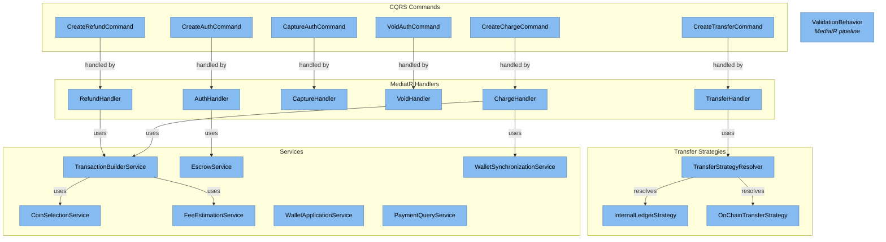

<!-- Generated by Atlas | Last updated: 2026-03-15 | Source commit: 3718dc7 -->
<!-- Edits below the ATLAS-END marker will be preserved on refresh -->

# Layer 3: Application Components

The Application layer implements CQRS command handling via MediatR, orchestrating domain operations without depending on infrastructure details. All Bitcoin payment flows (charge, authorize, capture, void, refund, transfer) are modeled as commands dispatched through a validation pipeline.

**Project:** `BitcoinPayments.Application` | **Framework:** net10.0 | **Dependencies:** MediatR 12.1, FluentValidation 12.1, Domain project

## Component Diagram

## Command → Handler Mapping

| Command | Handler | Response | Flow |
|---------|---------|----------|------|
| `CreateChargeCommand` | `ChargeHandler` | `PaymentResponse` | Sync UTXOs → select coins → build tx → broadcast → track UTXOs |
| `CreateAuthCommand` | `AuthHandler` | `AuthorizationResponse` | Sync UTXOs → build 2-of-2 multisig escrow → broadcast funding tx |
| `CaptureAuthCommand` | `CaptureHandler` | `PaymentResponse` | Spend escrow to merchant → broadcast capture tx |
| `VoidAuthCommand` | `VoidHandler` | `PaymentResponse` | Return escrow to buyer → broadcast void tx |
| `CreateRefundCommand` | `RefundHandler` | `PaymentResponse` | Verify parent settled → sync merchant UTXOs → build refund tx → broadcast |
| `CreateTransferCommand` | `TransferHandler` | `PaymentResponse` | Resolve strategy (auto/onchain/internal) → execute transfer |

## Services

### Transaction Building

| Service | Responsibility | Key Dependencies |
|---------|---------------|-----------------|
| `CoinSelectionService` | Largest-first UTXO selection with fee estimation | None (pure logic) |
| `FeeEstimationService` | Returns fee rate from request or config default | `IBitcoinSettings` |
| `TransactionBuilderService` | Builds and signs charge/refund transactions via NBitcoin | `CoinSelectionService`, `FeeEstimationService`, `IWalletKeyService` |
| `EscrowService` | Builds authorize/capture/void escrow transactions | `CoinSelectionService`, `FeeEstimationService`, `IWalletKeyService` |

### Wallet Operations

| Service | Responsibility | Key Dependencies |
|---------|---------------|-----------------|
| `WalletApplicationService` | User-scoped wallet CRUD, address derivation, UTXO listing, dev funding | `IWalletRepository`, `IUtxoRepository`, `IWalletKeyService`, `WalletSynchronizationService`, `IBitcoinNetwork` |
| `WalletSynchronizationService` | Pulls UTXOs from Bitcoin network for all derived addresses | `IWalletKeyService`, `IBitcoinNetwork`, `IUtxoRepository` |
| `PaymentQueryService` | Paginated transaction queries scoped to user's wallets | `ITransactionRepository`, `IWalletRepository`, `IBitcoinSettings` |

### Transfer System

| Component | Responsibility |
|-----------|---------------|
| `TransferStrategyResolver` | Picks strategy based on `Bitcoin.TransferMode` config: auto (internal if same user, on-chain otherwise), onchain (always), internal (always) |
| `InternalLedgerStrategy` | Ledger-only transfer — debit source, credit destination, no on-chain tx |
| `OnChainTransferStrategy` | Builds, signs, and broadcasts an on-chain Bitcoin transaction |

## Validation Pipeline

`ValidationBehavior<TRequest, TResponse>` is a MediatR pipeline behavior that runs FluentValidation validators before each handler. If validation fails, it throws `ValidationException` (caught by `ExceptionHandlingMiddleware` as 400).

**Validators:**
- `CreateChargeCommandValidator` — BuyerWalletId, MerchantWalletId, AmountSatoshis > 0, IdempotencyKey max 100 chars
- `CreateAuthCommandValidator` — Same as charge + AuthWindowBlocks > 0 if present
- `CaptureAuthCommandValidator` — AuthorizationId, AmountSatoshis > 0
- `VoidAuthCommandValidator` — AuthorizationId, IdempotencyKey
- `CreateRefundCommandValidator` — ParentTransactionId, AmountSatoshis > 0
- `CreateTransferCommandValidator` — Source != Destination, AmountSatoshis > 0

## Abstractions (Application Interfaces)

| Interface | Purpose | Implemented In |
|-----------|---------|---------------|
| `IBitcoinSettings` | Network config abstraction (network, fees, transfer mode, explorer URLs) | `BitcoinSettings` (Infrastructure) |
| `IWalletKeyService` | HD wallet creation, address derivation, private key access | `HdWalletManager` (Infrastructure) |
| `IWalletApplicationService` | Wallet CRUD contract for API layer | `WalletApplicationService` (this layer) |
| `IPaymentQueryService` | Transaction query contract for API layer | `PaymentQueryService` (this layer) |
| `ITransferStrategy` | Strategy pattern for transfer execution | `InternalLedgerStrategy`, `OnChainTransferStrategy` |

## DTOs

| DTO | Purpose |
|-----|---------|
| `PaymentResponse` | Charge/capture/void/refund/transfer result |
| `AuthorizationResponse` | Authorization result (includes escrow address, expiry block) |
| `TransactionStatusResponse` | Full transaction detail with wallet IDs and timestamps |
| `PagedResult<T>` | Generic paginated result (items, totalCount, page, pageSize) |
| `WalletResponse` | Wallet detail with balance and address indices |
| `WalletAddressResponse` | Generated receiving address with derivation index |
| `UtxoResponse` | UTXO detail for wallet inspection |
| `DevFundingResponse` | Dev-mode wallet funding result |

## DI Registration

`services.AddApplication()` registers:
- MediatR handlers (assembly scan)
- FluentValidation validators (assembly scan)
- `ValidationBehavior<,>` as `IPipelineBehavior<,>` (transient)
- All services as scoped: CoinSelection, FeeEstimation, TransactionBuilder, Escrow, WalletSync, WalletApp, PaymentQuery, transfer strategies, TransferStrategyResolver

<!-- ATLAS-END — edits below this line will be preserved on refresh -->
