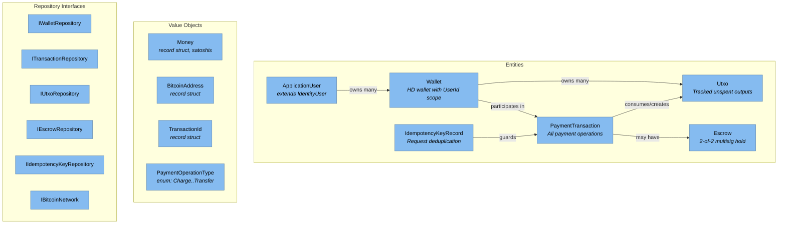

<!-- Generated by Atlas | Last updated: 2026-03-15 | Source commit: 3718dc7 -->
<!-- Edits below the ATLAS-END marker will be preserved on refresh -->

# Layer 3: Domain Components

The Domain layer is the innermost ring of the Clean Architecture — pure C# with no infrastructure dependencies. It defines the core entities, value objects, enums, repository interfaces, and domain events that model the Bitcoin payment domain.

**Project:** `BitcoinPayments.Domain` | **Framework:** net10.0 | **Dependencies:** NBitcoin 9.0.5, Microsoft.Extensions.Identity.Stores

## Component Diagram

## Entities

| Entity | Key Properties | Purpose |
|--------|---------------|---------|
| `Wallet` | Id, UserId, Name, MasterPublicKey, EncryptedMnemonic, NextReceivingIndex, NextChangeIndex, Network | HD wallet scoped to authenticated user. Master key encrypted via DataProtection |
| `PaymentTransaction` | Id, BuyerWalletId, MerchantWalletId, AmountSatoshis, FeeSatoshis, State, OperationType, BitcoinTxId, ConfirmationCount, IdempotencyKey, ParentTransactionId | All payment operations — charge, auth, capture, void, refund, transfer |
| `Utxo` | Id, WalletId, TransactionId, OutputIndex, AmountSatoshis, Address, ScriptPubKeyHex, IsSpent, IsEscrow, ConfirmationCount | Tracked unspent transaction outputs for coin selection |
| `Escrow` | Id, PaymentTransactionId, FundingTxId, RedeemScript, State, ExpiresAtBlock | 2-of-2 multisig escrow for authorize/capture/void flow |
| `IdempotencyKeyRecord` | Key, StatusCode, Body, ExpiresAt | Caches API responses for idempotent request handling |
| `ApplicationUser` | (extends IdentityUser) DisplayName | User identity with optional display name |

## Value Objects

| Type | Kind | Semantics |
|------|------|-----------|
| `Money` | record struct | Satoshi amount with arithmetic operators. Immutable, value equality |
| `BitcoinAddress` | record struct | Wraps string address with value equality |
| `TransactionId` | record struct | Wraps Bitcoin transaction hash with value equality |
| `PaymentOperationType` | enum | Charge=1, Auth=2, Capture=3, Void=4, Refund=5, Transfer=6 |

## Enums

| Enum | Values | Purpose |
|------|--------|---------|
| `TransactionState` | Created, Broadcasting, Mempool, FundingBroadcast, FundingConfirmed, AuthActive, CaptureBroadcast, CaptureConfirming, VoidBroadcast, VoidConfirming, Confirming, Settled, Voided, Expired, Failed, TransferCompleted | Full lifecycle state machine for all payment types |
| `EscrowState` | Created, Funded, Captured, Voided, Expired | Escrow lifecycle for authorize flow |
| `WalletAddressPurpose` | Receiving, Change | BIP32 derivation path purpose |

## Domain Interfaces

| Interface | Key Methods | Implemented By |
|-----------|------------|----------------|
| `IWalletRepository` | AddAsync, GetByIdAsync, ListByUserIdAsync, UpdateAsync | WalletRepository (Infrastructure) |
| `ITransactionRepository` | AddAsync, GetByIdAsync, GetByIdempotencyKeyAsync, ListPendingAsync, ListByWalletIdsAsync | TransactionRepository |
| `IUtxoRepository` | AddOrUpdateAsync, GetUnspentByWalletIdAsync, UpdateAsync | UtxoRepository |
| `IEscrowRepository` | AddAsync, GetByPaymentTransactionIdAsync, ListActiveAsync | EscrowRepository |
| `IIdempotencyKeyRepository` | GetAsync, UpsertAsync | IdempotencyKeyRepository |
| `IBitcoinNetwork` | BroadcastTransactionAsync, GetAddressUtxosAsync, GetTransactionStatusAsync, GetCurrentBlockHeightAsync, FundAddressAsync | NBitcoinNetworkService |

## Domain Events

| Event | Fields | Raised When |
|-------|--------|-------------|
| `PaymentCreated` | TransactionId | New payment transaction recorded |
| `PaymentBroadcast` | TransactionId, BitcoinTxId | Transaction broadcast to Bitcoin network |
| `PaymentConfirmed` | TransactionId, Confirmations | Confirmation count updated |
| `AuthExpired` | TransactionId | Authorization timelock expired |

## Domain Exceptions

| Exception | HTTP Mapping | Meaning |
|-----------|-------------|---------|
| `InsufficientFundsException` | 400 | Not enough UTXOs to cover amount + fees |
| `EscrowNotFoundException` | 404 | Referenced escrow doesn't exist |
| `InvalidOperationStateException` | 409 | Operation not valid in current transaction state |
| `AuthorizationExpiredException` | 409 | Auth hold timelock has expired |
| `TransactionBroadcastException` | 502 | Bitcoin network rejected the transaction |
| `DuplicateOperationException` | 409 | Attempted duplicate payment operation |
| `MainnetGuardException` | 500 | System attempted to operate on mainnet |
| `ForbiddenAccessException` | 403 | User lacks access to the resource |

<!-- ATLAS-END — edits below this line will be preserved on refresh -->
