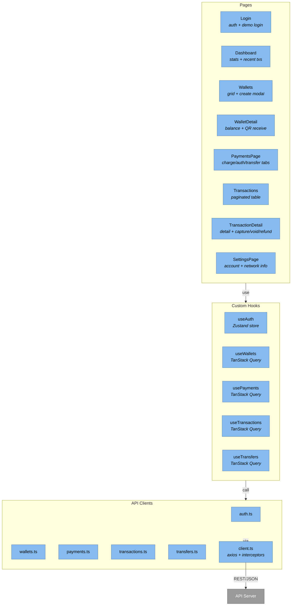

<!-- Generated by Atlas | Last updated: 2026-03-15 | Source commit: 3718dc7 -->
<!-- Edits below the ATLAS-END marker will be preserved on refresh -->

# Layer 3: Frontend Components

The ChainVault SPA is a React 19 single-page application built with Vite 8, Tailwind CSS v4, and TypeScript 5.9. It uses Zustand for auth state, TanStack Query for server state, and React Router v7 for navigation. Dark theme with zinc-950 base and amber/orange Bitcoin accents.

**Project:** `BitcoinPayments.UI` | **Stack:** React 19, Vite 8, Tailwind v4, TypeScript ~5.9

## Component Diagram

## Routing

| Path | Component | Auth | Notes |
|------|-----------|------|-------|
| `/login` | Login | No | Redirects to `/` if authenticated |
| `/` | Dashboard | Yes | Stats, recent transactions |
| `/wallets` | Wallets | Yes | Wallet grid with create modal |
| `/wallets/:id` | WalletDetail | Yes | Balance, QR receive address |
| `/payments` | PaymentsPage | Yes | Tabbed: charge, authorize, transfer |
| `/send` | — | — | Redirects to `/payments?tab=transfer` |
| `/transactions` | Transactions | Yes | Paginated table |
| `/transactions/:id` | TransactionDetail | Yes | Full detail with action buttons |
| `/settings` | SettingsPage | Yes | Account and network info |
| `*` | — | — | Redirects to `/` |

Protected routes use `ProtectedRoute` wrapper checking `useAuth().isAuthenticated`.

## State Management

### Auth State (Zustand)

`useAuth` store persists JWT tokens to `localStorage`:

| Field | Type | Purpose |
|-------|------|---------|
| `user` | `{id, email, displayName} \| null` | Current user info |
| `isAuthenticated` | boolean | Auth gate for protected routes |
| `login(accessToken, refreshToken, user)` | method | Stores tokens + user |
| `logout()` | method | Clears storage + resets state |
| `hydrate()` | method | Reads from localStorage on app init |

### Server State (TanStack Query)

QueryClient config: `staleTime: 30s`, `retry: 1`

| Hook | Query Key | Source | Notes |
|------|-----------|--------|-------|
| `useWallets()` | `['wallets']` | `listWallets()` | All user wallets |
| `useWallet(id)` | `['wallets', id]` | `getWallet(id)` | Single wallet detail |
| `useWalletAddress(id)` | `['wallets', id, 'address']` | `getWalletAddress(id)` | staleTime: 0 (always fresh) |
| `useTransactions(page, pageSize)` | `['transactions', page, pageSize]` | `listTransactions()` | Paginated |
| `useTransaction(id)` | `['transaction', id]` | `getTransaction(id)` | refetchInterval: 15s (live updates) |
| `useTransactionHistory(id)` | `['transaction', id, 'history']` | `getTransactionHistory(id)` | State timeline |

**Mutation invalidation:** All payment/transfer mutations invalidate `['wallets']` and `['transactions']` for immediate UI consistency.

## API Client Layer

### Axios Instance (`client.ts`)

- Base URL: `/api/v1`
- Request interceptor: attaches `Bearer {accessToken}` from localStorage
- Response interceptor: on 401 → attempts refresh via `/accounts/refresh-token` → retries original request. On refresh failure → clears storage, redirects to `/login`

### API Modules

| Module | Endpoints Called |
|--------|----------------|
| `auth.ts` | POST `/accounts/login`, `/accounts/register`, `/accounts/demo-login` |
| `wallets.ts` | GET/POST `/wallets`, GET `/wallets/:id`, `/wallets/:id/address` |
| `payments.ts` | POST `/payments/charge`, `/authorize`, `/capture`, `/void`, `/refund`; GET `/payments/:id`, `/payments/:id/history` |
| `transactions.ts` | GET `/transactions?page=&pageSize=` |
| `transfers.ts` | POST `/transfers` |

All POST endpoints auto-generate `Idempotency-Key: {uuid}` headers.

## Page Details

| Page | Key Features |
|------|-------------|
| **Login** | Hero section, sign-in/register tabs, "Try Demo" button, amber accent styling |
| **Dashboard** | 3 stat cards (balance, wallets, transactions), recent transactions table |
| **Wallets** | Grid cards with balance + network, create modal with name input, skeleton loaders |
| **WalletDetail** | Info card, QR code (qrcode.react), copy address button, link to send |
| **PaymentsPage** | 3 tabs (Charge/Authorize/Transfer), wallet dropdowns, amount input, confirmation modal |
| **Transactions** | Paginated table (type, state, from/to, amount, fee, txid, date), row click → detail |
| **TransactionDetail** | Full detail card, Bitcoin txid with copy + explorer link, conditional action buttons (capture/void/refund), state history timeline |
| **SettingsPage** | Read-only account info, network status, transfer mode, security overview |

## Layout

| Component | Purpose |
|-----------|---------|
| `AppLayout` | Two-column: fixed sidebar (w-64) + scrollable main content. Dark vault gradient background |
| `Sidebar` | Brand logo, nav links (Dashboard, Wallets, Payments, History, Settings), active indicator, user section with logout |
| `StateBadge` | Color-coded transaction state pill: green (settled), blue (confirming), amber (mempool), red (failed), zinc (voided/expired) |

## Key Dependencies

| Package | Version | Role |
|---------|---------|------|
| react / react-dom | ^19.2.4 | Core UI framework |
| react-router-dom | ^7.13.1 | Client-side routing |
| @tanstack/react-query | ^5.90.21 | Server state cache + mutations |
| zustand | ^5.0.11 | Client auth state |
| axios | ^1.13.6 | HTTP client with interceptors |
| tailwindcss | ^4.2.1 | Utility-first CSS |
| lucide-react | ^0.577.0 | Icons |
| qrcode.react | ^4.2.0 | QR code for wallet addresses |
| react-hot-toast | ^2.6.0 | Toast notifications |

<!-- ATLAS-END — edits below this line will be preserved on refresh -->
