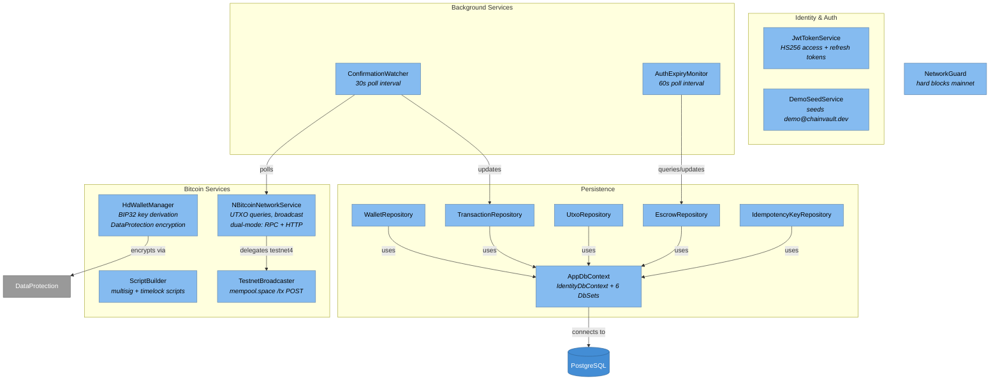

<!-- Generated by Atlas | Last updated: 2026-03-15 | Source commit: 3718dc7 -->
<!-- Edits below the ATLAS-END marker will be preserved on refresh -->

# Layer 3: Infrastructure Components

The Infrastructure layer implements all domain interfaces and provides concrete integrations: EF Core persistence with PostgreSQL, Bitcoin network operations via NBitcoin + mempool.space, HD wallet key management with DataProtection encryption, JWT authentication, and background services for confirmation tracking and auth expiry.

**Project:** `BitcoinPayments.Infrastructure` | **Framework:** net10.0 | **Dependencies:** EF Core 10.0.5, NBitcoin 9.0.5, Npgsql, JWT Bearer, Polly

## Component Diagram

## Bitcoin Services

| Class | Implements | Responsibility |
|-------|-----------|----------------|
| `HdWalletManager` | `IWalletKeyService` | Creates wallets (12-word mnemonic), derives BIP32 addresses (m/44'/1'/0'), returns private keys. Mnemonics encrypted via ASP.NET DataProtection |
| `NBitcoinNetworkService` | `IBitcoinNetwork` | Dual-mode network access: RPC for regtest, mempool.space HTTP API for testnet4. UTXO queries, transaction broadcast, confirmation status, block height. Uses Polly retry |
| `ScriptBuilder` | — | Pure script generation: 2-of-2 multisig redeem scripts, CLTV timelock refund scripts |
| `TestnetBroadcaster` | — | Posts raw transaction hex to mempool.space `/tx` endpoint. Throws `TransactionBroadcastException` on failure |

## Persistence

### AppDbContext

Extends `IdentityDbContext<ApplicationUser>`. Schema: `payments`.

**DbSets:** Wallets, PaymentTransactions, Utxos, Escrows, IdempotencyKeys, RefreshTokens

**Entity Configurations** (via `IEntityTypeConfiguration<T>`):

| Entity | Table | Notable Config |
|--------|-------|---------------|
| Wallet | `wallets` | FK to AspNetUsers.Id |
| PaymentTransaction | `payment_transactions` | Unique index on IdempotencyKey; indexes on State, BitcoinTxId, ParentTransactionId |
| Utxo | `utxos` | Unique composite on (TransactionId, OutputIndex); index on (WalletId, IsSpent) |
| Escrow | `escrows` | FK to PaymentTransactions.Id |
| RefreshToken | `refresh_tokens` | Unique on Token; index on UserId |
| IdempotencyKeyRecord | `idempotency_keys` | PK on Key; index on ExpiresAt |

**Value Converters:** Money ↔ long, BitcoinAddress ↔ string, TransactionId ↔ string, Dictionary ↔ JSONB

### Repositories

All repositories are scoped services injecting `AppDbContext`:

| Repository | Notable Methods |
|-----------|----------------|
| `WalletRepository` | `ListByUserIdAsync` — user-scoped wallet listing |
| `TransactionRepository` | `ListPendingAsync` — finds transactions needing confirmation tracking; `ListByWalletIdsAsync` — paginated, ordered by CreatedAt desc |
| `UtxoRepository` | `AddOrUpdateAsync` — upsert by (TxId, OutputIndex); `GetUnspentByWalletIdAsync` — for coin selection |
| `EscrowRepository` | `ListActiveAsync` — escrows in Created or Funded state (for expiry monitoring) |
| `IdempotencyKeyRepository` | `UpsertAsync` — creates or updates cached response |

## Identity & Authentication

| Class | Responsibility |
|-------|---------------|
| `JwtTokenService` | Generates HS256-signed access tokens (claims: sub, email, jti, display_name). Single-use refresh tokens stored in DB with expiry. Access: 15min/60min, Refresh: 7d/30d |
| `JwtOptions` | POCO config: Secret, Issuer (ChainVault), Audience (ChainVault.SPA), token lifetimes |
| `RefreshToken` | Entity: Token (64-byte random, base64), ExpiresAt, RevokedAt. `IsActive` = not revoked and not expired |
| `DemoSeedService` | Idempotent startup seed: creates demo@chainvault.dev / Demo123! with 3 wallets and 3 sample transactions |

## Background Services

| Service | Interval | Behavior |
|---------|----------|----------|
| `ConfirmationWatcher` | 30s | Polls mempool.space for pending transactions. Updates confirmation counts. Transitions states: Mempool→Confirming→Settled, FundingBroadcast→AuthActive, CaptureBroadcast→Settled, VoidBroadcast→Voided |
| `AuthExpiryMonitor` | 60s | Queries active escrows. Compares `ExpiresAtBlock` against current block height. Expires stale authorizations and transitions to `Expired` state |

## Configuration

| Class | Bound To | Key Fields |
|-------|----------|------------|
| `BitcoinOptions` | `Bitcoin` section | Network, DefaultFeeRateSatPerByte, AuthWindowBlocks, MinConfirmationsForSettlement, MempoolApiBaseUrl, AllowMainnet, RpcUri/User/Password, TransferMode |
| `BackgroundServiceOptions` | `BackgroundServices` section | ConfirmationWatcherIntervalSeconds (30), AuthExpiryCheckIntervalSeconds (60) |
| `BitcoinSettings` | — | Implements `IBitcoinSettings`. Adapts `BitcoinOptions` to application abstraction. Builds explorer URLs |
| `NetworkGuard` | — | Static startup check. Throws `MainnetGuardException` if network resolves to mainnet or `AllowMainnet=true` |

## DI Registration

`services.AddInfrastructure(configuration)` registers:
- **Config:** BitcoinOptions, BackgroundServiceOptions, JwtOptions
- **DataProtection:** IDataProtectionProvider
- **DbContext:** AppDbContext with Npgsql
- **Identity:** ApplicationUser with strict password policy, JWT Bearer auth (HS256, validates issuer/audience/lifetime)
- **Repositories:** All 5 as scoped
- **Bitcoin:** HdWalletManager (scoped), BitcoinSettings (singleton), ScriptBuilder (singleton), TestnetBroadcaster (singleton), NBitcoinNetworkService (singleton)
- **HTTP:** Named client for mempool.space with Polly standard resilience
- **Background:** ConfirmationWatcher, AuthExpiryMonitor as hosted services

<!-- ATLAS-END — edits below this line will be preserved on refresh -->
