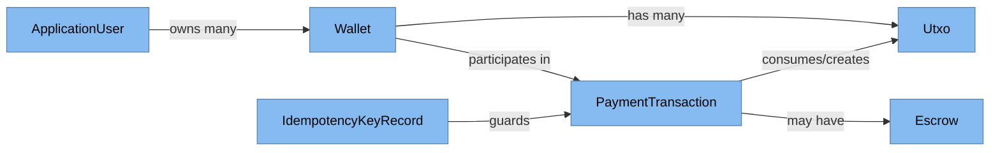
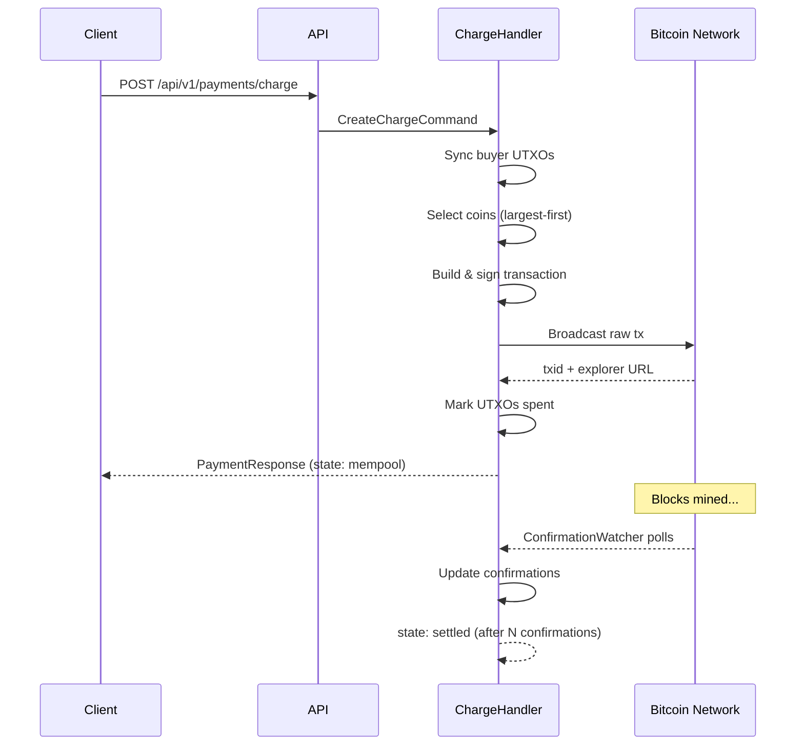
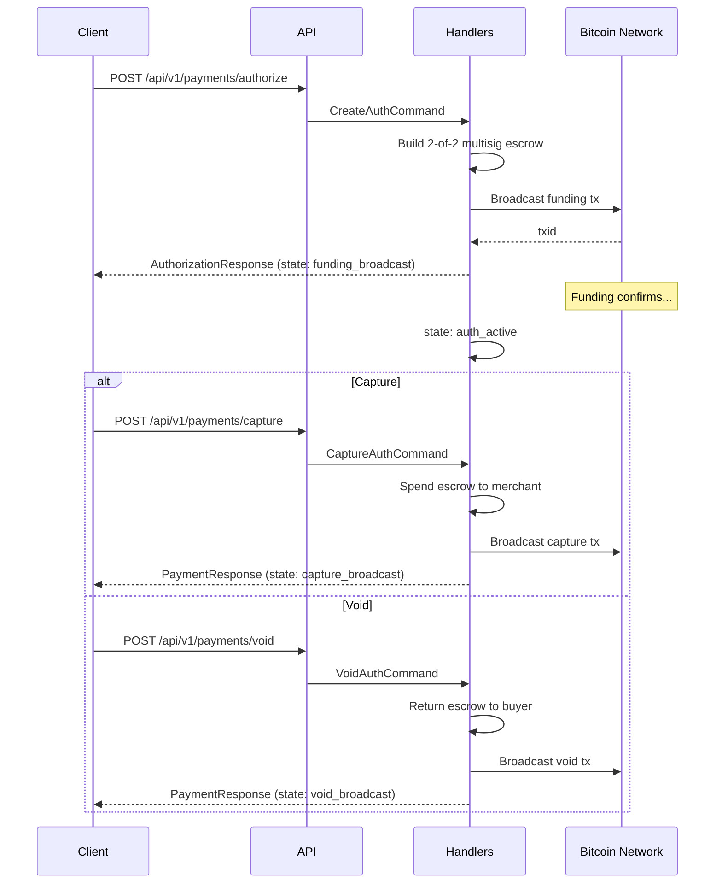
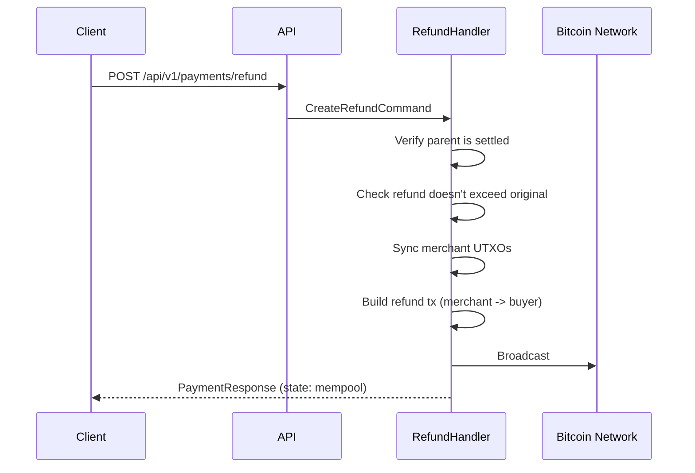
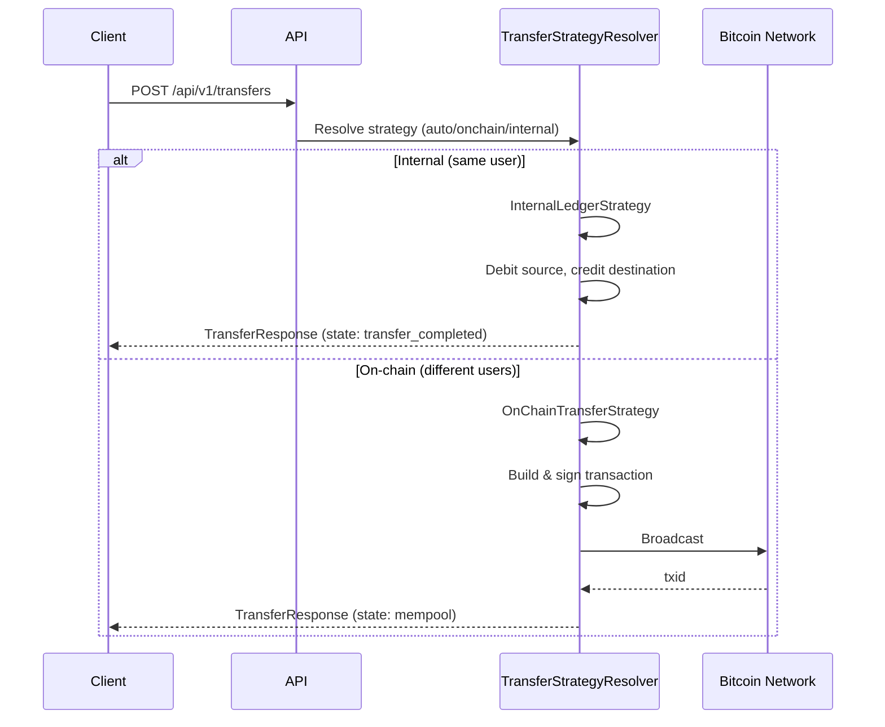
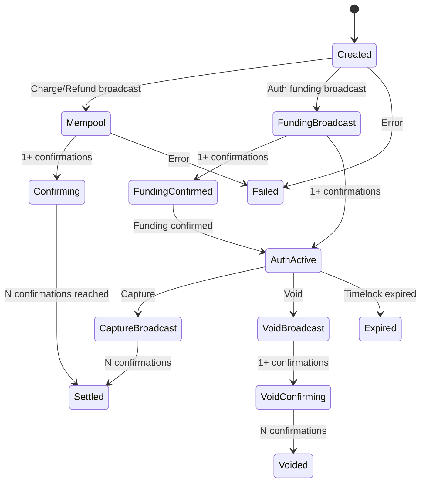

<!-- Generated by Atlas | Last updated: 2026-03-15 | Source commit: 3718dc7 -->
<!-- Edits below the ATLAS-END marker will be preserved on refresh -->

# Layer 4: Data Flow

This document traces primary data paths through ChainVault — how payments enter the system, move through processing, interact with the Bitcoin network, and persist to the database.

## Domain Model Overview

## Payment Flows

### Charge Flow (Direct Payment)

### Authorize / Capture / Void Flow

### Refund Flow

### Transfer Flow

## Transaction State Machine

## Data Persistence Model

### Core Tables

| Table | Key Columns | Purpose |
|-------|-------------|---------|
| `Wallets` | Id, UserId, Name, MasterPublicKey, NextAddressIndex | HD wallet with encrypted master key, user-scoped |
| `PaymentTransactions` | Id, BuyerWalletId, MerchantWalletId, AmountSatoshis, State, TxId | All payment operations (charge, auth, capture, void, refund, transfer) |
| `Utxos` | Id, WalletId, TxId, OutputIndex, AmountSatoshis, IsSpent | Tracked UTXOs for coin selection |
| `Escrows` | Id, TransactionId, FundingTxId, RedeemScript, State | 2-of-2 multisig escrow for authorize/capture/void |
| `IdempotencyKeyRecords` | Key, Response, CreatedAt | Deduplication of payment requests |

### Identity Tables (ASP.NET Core Identity)

| Table | Purpose |
|-------|---------|
| `AspNetUsers` | User accounts (extends IdentityUser as ApplicationUser) |
| `RefreshTokens` | JWT refresh token storage with expiry tracking |

### Data Flow Paths

| Flow | Write Path | Read Path |
|------|-----------|-----------|
| **Wallet creation** | API → WalletApplicationService → WalletRepository → PostgreSQL | API → WalletRepository → PostgreSQL |
| **UTXO sync** | Mempool.space → WalletSynchronizationService → UtxoRepository → PostgreSQL | CoinSelectionService → UtxoRepository → PostgreSQL |
| **Payment execution** | Handler → TransactionBuilderService → NBitcoin → Mempool.space (broadcast) → TransactionRepository → PostgreSQL | API → PaymentQueryService → TransactionRepository → PostgreSQL |
| **Confirmation tracking** | ConfirmationWatcher → Mempool.space (poll) → TransactionRepository → PostgreSQL | Automatic (background) |
| **Auth expiry** | AuthExpiryMonitor → TransactionRepository → PostgreSQL | Automatic (background) |

<!-- ATLAS-END — edits below this line will be preserved on refresh -->
